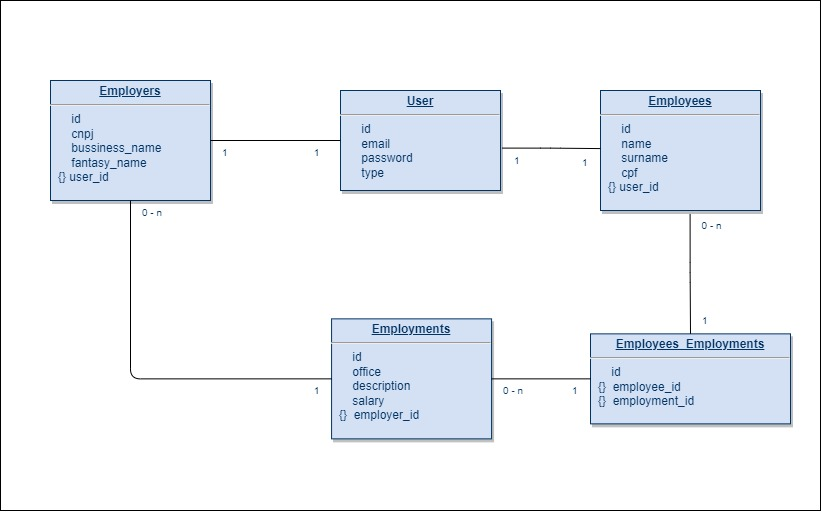

# Jobs4U Back-end
# Preparando a aplicação

* Certifique-se que o banco de dados esteja em execução

* Ao clonar o repositorio navegue ate o diretorio `back-end/laravel`, para navegar entre diretorios utilize
    ```bash
    cd <caminho-do-diretorio-do-projeto>
    ```

## Download de dependencias
* instale as dependencias do projeto utilizando o [`composer`](https://getcomposer.org/)
    ```bash
    composer install
    ```

## Estruturando banco de dados
* para criar as tabelas no banco de dados.
    ```bash
    php artisan migrate
    ```

* para popular as tabelas no banco de dados.
    ```bash
    php artisan db:seed --class=DataBaseSeeder
    ```

## Executando a aplicação

* inicie a aplicacao
    ```bash
    php artisan serve
    ```

## Documentação dos end-points
 A documentação dos end-points foi desenvolvida utilizando o [swagger](https://swagger.io/specification) pode ser acessada localmente em http://127.0.0.1/api-documentation/index.html

## Relacionamento entre as entidades do Banco de dados

